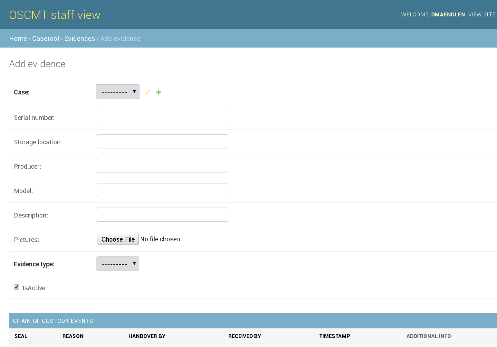

# Manual for [OSCMT](https://github.com/oscmt/oscmt)
## Installation
## Usage
### How to create groups and users
Log in as administrator, you'll get this view:

Next, click on the "Add" button next to "Users". Fill out the resulting screen and
click "save".

To create a group, click on the "Add" button next to "Groups", fill out the form
and click "save".

Todo: Figure for creating a group

### How to manage permissions
Todo: Figure for managing permissions

### How to create a new Case
Log in as a regular user, you'll get this view:

Now click on "Add" next to "Cases", fill out the form and make sure to complete
all bold fields (non-bold fields are optional and can be left alone.) If an item
needs to be created first, you can add it by clicking the green plus sign next
to the respective fields.

### How to create a new Evidence Item

To create a new Evidence Item, navigate to the main overview and click "Add"
next to "Evidence Items". Fill out the form and make sure to fill all bold
fields. If an item needs to be created first, you can add it by clicking the
green plus sign next to it.

### How to create a new Chain of Custody Event

Navigate to the Evidence Item for which you wish to create a new chain of
custody event. Scroll down until you reach the Chain of Custody event form. Fill
out the form and save.

Todo: Figure for creating Chain of Custody events

### How to search for a Case

Navigate to the main view, shown in [How to create a new
Case](#how-to-create-a-new-case) and click on "Cases". You will get an overview
over your Cases and a search bar.

### How to search for an Evidence Item

Navigate to the main view, shown in [How to create a new
Case](#how-to-create-a-new-case) and click on "Evidence Items". You will get an
overview over your Cases and a search bar.

